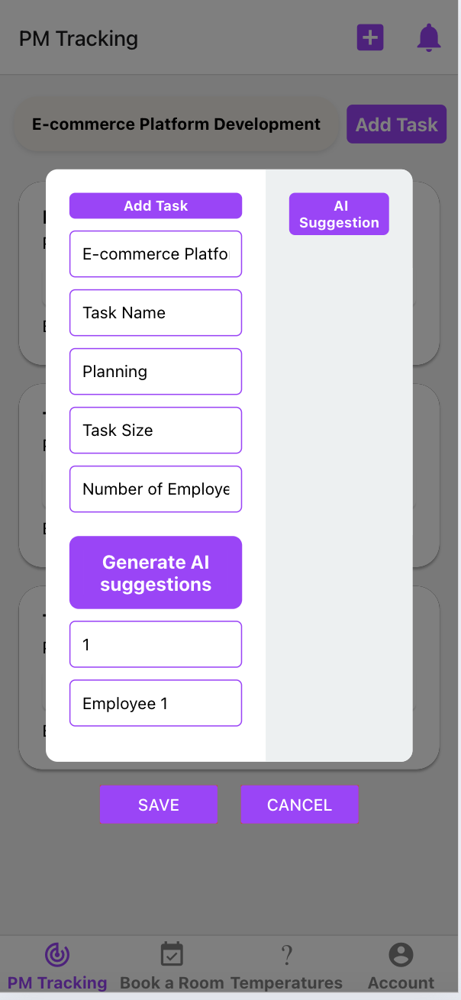

# Capstone
 Implemented IOT based smart work environment with features such as room temperature control, project progress tracker, and meeting room bookings.

https://docs.google.com/document/d/1uZbmDVLqCb8FDmRxZIdlWywzlvmDPpz_/edit?usp=sharing&ouid=111034685541825038499&rtpof=true&sd=true

# Images

### Register Page

### Login Page

### Project Management Page

### Phases Page

### Tasks Page

### AI Suggestions Tab

### Notification Tab

### Book Meeting Room Page
