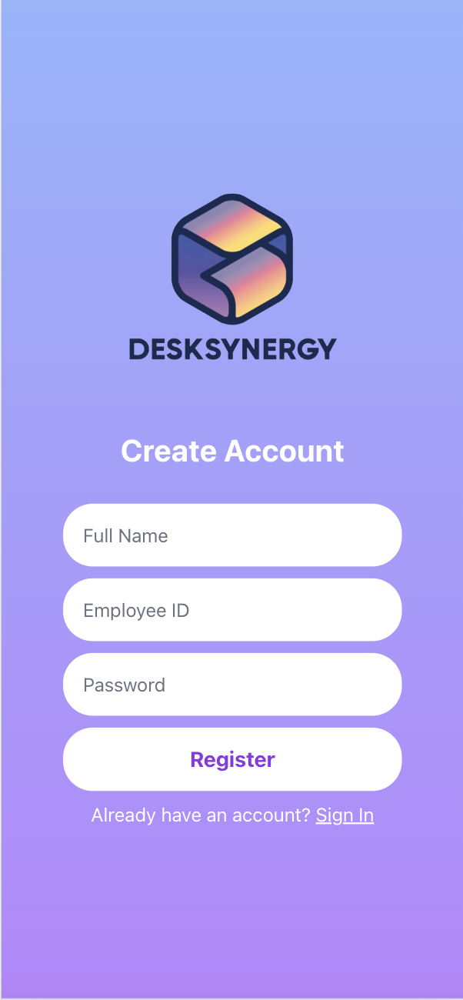
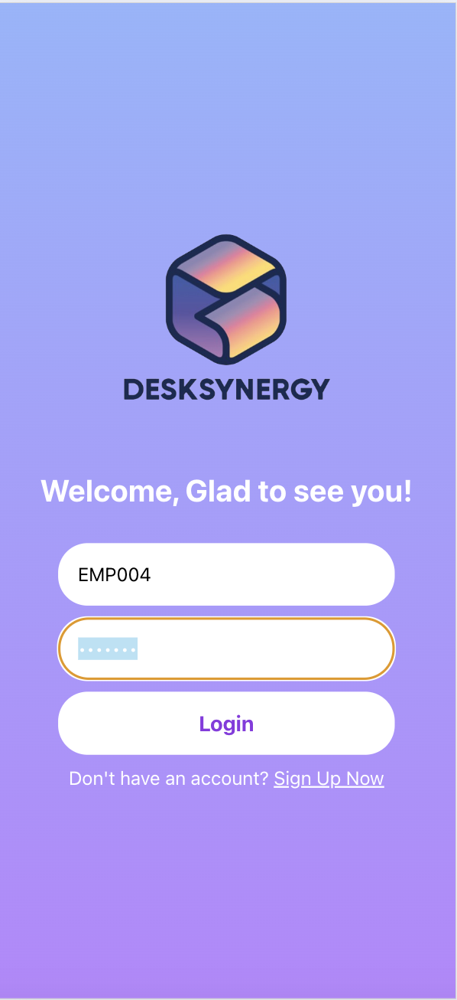
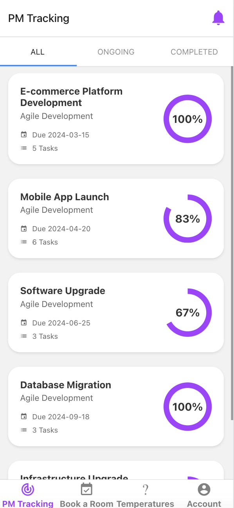
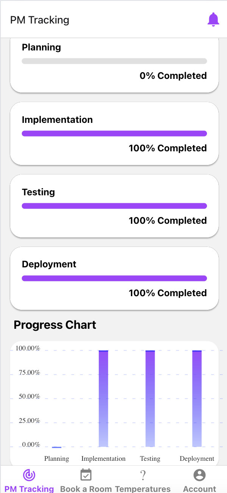
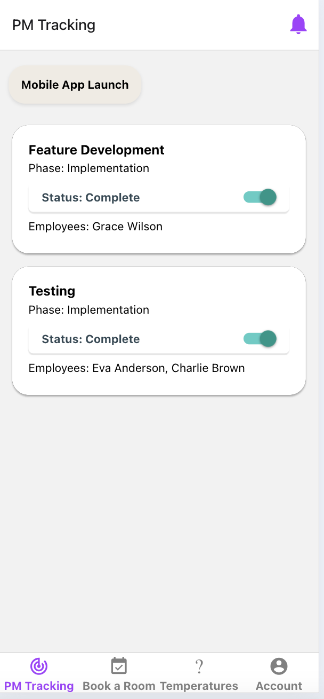
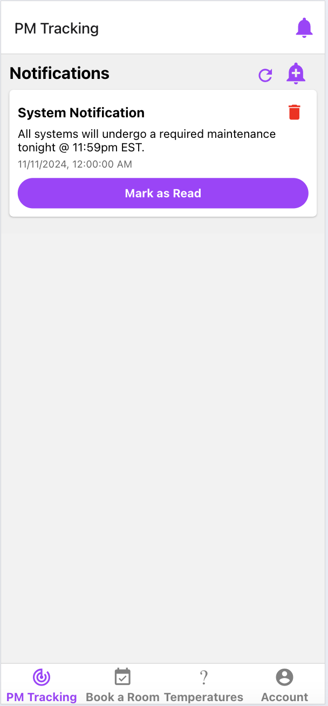

# Capstone
 Implemented IOT based smart work environment with features such as room temperature control, project progress tracker, and meeting room bookings.

https://docs.google.com/document/d/1uZbmDVLqCb8FDmRxZIdlWywzlvmDPpz_/edit?usp=sharing&ouid=111034685541825038499&rtpof=true&sd=true

# Images
Register Page

Login Page

Project Management Page

Phases Page

Tasks Page

Notification Tab

Book Meeting Room Page
